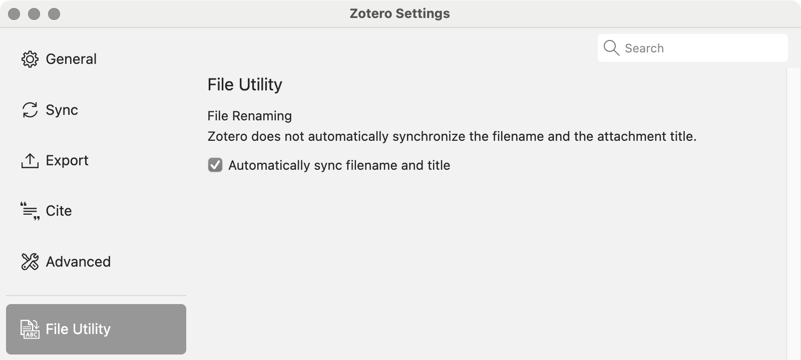

# Zotero File Utility Plugin

## Overview

The Zotero File Utility Plugin is designed to provide additional functionality that complements the significant improvements in functionality and user experience introduced in Zotero version 7. While Zotero's developers have made important strides, this plugin addresses specific needs for users who require more control over file management within Zotero.

## Features

### 1. Automatic Synchronization of Attachment Titles and Filenames

Zotero typically keeps the attachment title and the filename on disk as separate entities. This can create inconsistencies and confusion, especially when managing large libraries. This plugin ensures that the attachment title in Zotero always matches the filename on disk, keeping your library organized and consistent. This synchronization runs in the background as long as the corresponding preference is enabled.

### 2. Convert Stored Files to Linked Files

Zotero supports the conversion of linked files to stored files but does not provide an option to convert stored files back to linked files. This plugin introduces the ability to convert stored files into linked files within your specified "Linked Attachments Base Directory." This feature can be accessed under the `Tools -> Manage Attachments` menu in Zotero.
and are useful for advanced users who manage their Zotero libraries across multiple devices or prefer to use external storage solutions like Dropbox or Google Drive.

## Installation

### From Local File

1. Download the latest release (.xpi file) from the [Latest Release Page](https://github.com/HansJoakimPersson/zotero-file-utility/releases/latest).
    - **Note:** If you're using Firefox as your browser, right-click the `.xpi` file and select "Save As.."
2. In Zotero, click `Tools` in the top menu bar and then click `Add-ons`.
3. Go to the `Extensions` page and then click the gear icon in the top right.
4. Select `Install Add-on from file...`.
5. Browse to where you downloaded the `.xpi` file and select it.

## Configuration

The configuration for the Zotero File Utility Plugin can be accessed under `Zotero → Settings`.

By default, the plugin’s settings focus on automatically synchronizing the filename and the attachment title. This option ensures that the attachment titles in Zotero match the filenames on disk, improving file management and organization.

These options are saved as Zotero preferences variables, which are also available through the [Config Editor](https://www.zotero.org/support/preferences/advanced).

## Feedback

Suggestions/improvements are
[welcome](https://github.com/HansJoakimPersson/zotero-file-utility/issues)! Please feel free to submit a pull request or open an issue for any feature requests or bugs.

## ¯\\_(ツ)_/¯ Disclaimer / Warning / Liability

> Warning:
> This plugin is provided "as is" without any warranties or guarantees. The author takes no responsibility for any issues or damages that may result from the use of this plugin. :)

## License

This project is licensed under the MIT License. Please see [the license file](LICENSE.md) for more information.
